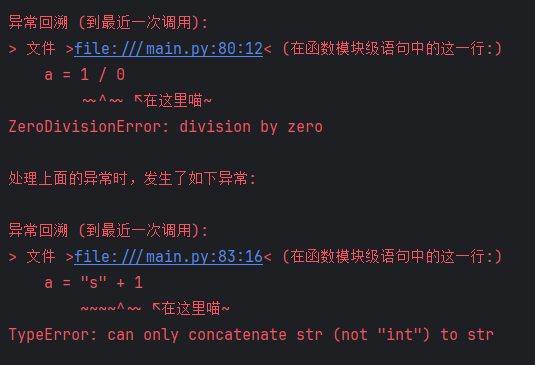

# 面向数学建模编程

## 前言

本教程结合个人经验，为时间有限的准编程手们提供尽可能时间上最有效的教程。如果你时间充足希望系统学习，你可以看看[我是怎么学习的](/t199)。

**[警告]** 本文包含大量主观内容，可以提供有限的方向参考，但切勿总是奉为圭臬。

## 开始

首先，面向数学建模从零完整开始学习编程语言这件事的代价就是极高的。更好的方案是学习语言的基本数据结构和语法，然后尝试“理解”编程语言。

下面是我自行量化的学习项目表，可根据自身情况自行选修。

对于Python、MATLAB、北太天元，选择一项深入学习，否则适合你的题型面将非常少。SPSS最好只作为初级工具使用。

对于新兴的国产分析软件[北太天元](https://www.baltamatica.com/download.html)，我的态度是十分支持。北太天元语法高度兼容MATLAB语法，既避免了被MATLAB卡脖子又有国内开发者生态。但其工具箱生态仍在发展中，复杂问题可能需要自行实现算法，要做好转回MATLAB的准备。

| 项目              | 重要程度               | 学习难度 | 地位                                                         |
| ----------------- | ---------------------- | -------- | ------------------------------------------------------------ |
| 程序设计          | ★★★★★[编程手·任何时候] | ★★☆☆☆    | 否则编程根本无从下手                                         |
| Python语法        | ★★★★★[用Python时]      | ★★★★☆    | 绝对T0，最接近神的一个<br />通用性和体系都是最完善的         |
| MATLAB语法        | ★★★★★[用MATLAB时]      | ★★★☆☆    | T0.5，数学建模方面够用<br />MATLAB在工业级广泛应用           |
| 北太天元语法      | ★★★★★[用北太天元时]    | ★★★☆☆    | T1，工具箱规模没有MATLAB大<br />但数学建模目的完全够用       |
| SPSS              | ★★★☆☆[用SPSS时]        | ★★☆☆☆    | 仅适用离散题型，且并非特别万能                               |
| SPSSAU            | ★★★☆☆[做离散题时]      | ★☆☆☆☆    | 仅适用离散题型<br />注意，SPSSAU是在线付费的                 |
| Excel高级统计操作 | ★★☆☆☆[做离散题时]      | ★☆☆☆☆    | 离散题型的数据预处理                                         |
| 算法              | ★★☆☆☆[做综合题时]      | ★★★★★    | 一些综合题可能需要编程算法解决<br />但初学者可以先跳过这类题 |

## 面向数学建模的Python学习路线

### 1. 尽快提升熟练度

对于Python初学者，如果没有时间可以不学面向对象(就是类、继承那一堆乱七八糟的)，但内置数据类型的处理一定要熟练运用。比如这种技术上不难但实操起来十分吃**熟练度**的问题：

#### **将一个布尔值列表转换为时间区间格式**

```python
# 输入
series = [False, False, True, True, False, False, True, True, True, True, True, False, True]
# 输出
assert solve(series) == {
    "start": [2, 6, 12],
    "end": [4, 11, 13],
    "duration": [2, 5, 1]
}
```

- 注意：新手面对这个问题可以使用暴力遍历，但老手可以使用numpy的向量化操作简化流程，具体步骤可以自行研究

### 2. 快速掌握报错信息和调试

学习过程中最好尽快掌握怎么看报错和PDB(`breakpoint()`)的使用。

> 打个广告：我正在开发 [kawaiitb](#kawaiitb) 库，用于汉化甚至自定义python的报错信息，能参与测试、提议或者单纯想试用的可以联系我

其次要系统学习numpy,pandas和matplotlib三个库。其中numpy用于数据计算、pandas用于数据存储、matplotlib用于数据展示。这三个库不是终点，而是更多复杂的库（如sklearn高级数学模型、seaborn绘图等）的基础。

最后是学会看**代码的意图**。哪怕是我正式比赛环境敲代码也不会一行行去敲，而是先想好我要做什么，再描述出来，最后让AI把我**已经想好的逻辑**以代码形式展现出来。这时一旦代码出了bug，我就需要理解它写出来的代码的意图是什么，理解不了就使用**调试功能**跑一遍。然后找到对应问题进行修正。

## 使用AI进行编程

> 最后让AI把我**已经想好的逻辑**以代码形式展现出来。

比方说我希望进行PCA分析，首先我要写下面的代码

```python
# 我给AI的提示代码
INPUT_FILE = "data.xlsx"
X_cols = ["IN1","IN2","IN3","IN4","IN5"]
...
X_data = ...
X_std = ...

```

然后再让AI续写一个PCA分析。这样可以省去很多麻烦事比如问你数据在哪又问你是什么格式需不需要去重、标准化……

```python
# AI生成的代码
from sklearn.decomposition import PCA
from sklearn.preprocessing import StandardScaler
import pandas as pd

data = pd.read_excel(INPUT_FILE)
X_data = data[X_cols]
X_std = StandardScaler().fit_transform(X_data)
pca = PCA(n_components=2)
principal_components = pca.fit_transform(X_std)
```

### 1. AI选型

众所周知、AI的智商有高有低，此处以多功能的[豆包](https://www.doubao.com/chat/)和高智商的[DeepSeek](https://chat.deepseek.com/)为例：

| 问题                               | 选型                                                         |
| ---------------------------------- | ------------------------------------------------------------ |
| 螺线的长度怎么求                   | 豆包(熟知的已知结论)                                         |
| 帮我翻译一下这个论文               | 豆包(能够快速响应)                                           |
| 推荐几个数据分析网站               | 豆包(搜索能力)                                               |
| 写一个去除前后缀的函数             | 豆包(简单任务没必要浪费Deepseek时间)                         |
| 将这句话用论文表述出来             | Deepseek(语言表述多样化)                                     |
| 构建基于xxx的微分方程              | Deepseek(高强度场景理解)                                     |
| 这段论文表述有没有什么致命错误     | Deepseek(思维链能够细致分析)                                 |
| 令tf模型每训练一个批次缓存一个副本 | Deepseek(单纯的智商高)                                       |
| 把这个一万行的文件里的异常值找出来 | 不适合AI(大量数字中AI很可能忽视信息)<br />可以改为令其写python代码找出异常值 |
| 帮我画一个这个数学模型的结构示意图 | 不适合绘图AI(绘图AI偏向艺术领域)<br />可以改为令其写代码后在线生成如 [mermaid.live](mermaid.live) |
| 帮我解这个复杂的微分方程           | 不适合AI(AI很容易在长竖式中出错)<br />可以使用在线求解工具如 [W\|A](https://www.wolframalpha.com) |

- 多功能AI可以类比国内市面上的各种AI比如混元、文心一言等等。功能都是较为完善的。

- 高智商AI中Deepseek是最方便的，替代有OpenAI的o1-mini, o1, o3-mini等。不可否认o3虽然非常厉害，但每日限制使其难以适应三天数模的节奏，当然一些特别棘手的问题问一下也是可以的。

### 2. AI给我的代码出现了一个问题

别急，AI代码的问题无非以下几种：

1.**你给它的数据和描述不对版**

有时候它不检查是因为太信任你。额外检查是因为不信任你。如果你想让他发挥的更自由，你就说`你是xx领域专家，请帮我……`，否则如果你很清楚接下来你想做什么，你就说`你是听话的python助手，现在……`。

2.**命名不规范**

AI的命名通常是十分有意义的。但这有时候会让它们造成依赖，比如他们排序之后错误地将前面已经排序好的列名`sorted_inputs = ['IN1','IN2','IN3']`当作数据`[4,3,2]`，尝试使用数据定位列名，结果就会造成类型不匹配或者找不到(有时会造成`None`的出现)的情况。这时候就是代码意图理解和python学习成果展现的时候了。

3.**多字缺字**

目前我只在deepseek-v3上见过这样的情况。对于ai来说这是很奇异的，但一般来说这种错误只要找到它缺了哪个括号、多了哪个括号处理一下就行了(大部分都是多了)。

### 3. 人机协同

|                | AI知道的                                                     | AI不知道的                                                   |
| -------------- | ------------------------------------------------------------ | ------------------------------------------------------------ |
| 你应该知道的   | 使用python能做哪些事<br />e.g. <br />使用python当然能够进行数据清洗 | 你的题目长什么样<br />e.g. <br />表格的输入列为["IN1","IN2",...] |
| 你可能不知道的 | 某些库代码上具体怎么写<br />e.g.<br />从sklearn中引入支持向量机回归的具体方法 | 最终的问题<br />e.g.<br />评委想看到论文的研究方向           |

## 链接

**[通用]** 非常全面的Python图网站 - [Python Graph Gallery](https://python-graph-gallery.com/)

**[离散]** 大量免费的数据集和模型 - [Kaggle](https://www.kaggle.com/)

**[连续]** 让AI帮你解方程 - [Wolfram|Alpha](https://www.wolframalpha.com/)

**[几何]** 高效画图，设置动点 - [GeoGebra](https://www.geogebra.org/calculator)


# KawaiiTB

联系我: mc-puffer@qq.com


